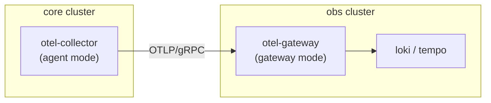

# Lab, Cluster, and Component Hierarchy

Catallaxy organizes infrastructure in a four-level hierarchy: **Lab > Cluster > Component > Phase/Bundle**. Each level adds structure and enables cross-references that the NixOS module system resolves through lazy evaluation.

## Labs

A lab is a multi-cluster environment. It defines which clusters exist, how they relate to each other, what infrastructure services run alongside them (DNS, registry, ingress proxy), and what deployment strategy to use.

```nix
# examples/labs/labs/default.nix
{ config, lib, ... }:
{
  lab.name = "homelab.local";
  lab.cd.strategy = "kapp";

  lab.clusters.core = { imports = [ ../clusters/core.nix ]; };
  lab.clusters.obs  = { imports = [ ../clusters/obs.nix ]; };
  lab.clusters.mgmt = { imports = [ ../clusters/mgmt.nix ]; };
}
```

Labs provide:

- **Cluster composition** -- Which clusters exist and what modules they import
- **Shared infrastructure** -- DNS servers, container registries, TLS ingress proxies (all managed as Docker containers alongside the clusters)
- **Deployment strategy** -- Whether to render output for kapp (direct apply), ArgoCD, or Fleet
- **Ops commands** -- Component-aware shell scripts for operational tasks like resetting passwords or triggering backups
- **Environment layering** -- A lab is composed from aspects (feature modules) and environment deltas (provisioner, DNS, TLS settings) via `mkLab`

### Example Lab Structure

```
examples/labs/
  flake.nix                # Composes: mkLab [ labs/default.nix envs/local.nix ]
  aspects/                 # Pure feature modules (no env awareness)
    networking.nix
    identity.nix
    gitops.nix
  clusters/                # Aspect composition
    core.nix               # = networking + identity + gitops + ...
    obs.nix                # = networking + monitoring
  labs/
    default.nix            # Lab topology + shared ops
  envs/                    # Thin environment deltas
    local.nix              # k3d provisioner, local DNS
    prod.nix               # DO provisioner, ACME TLS
```

This layering means the same cluster definitions can target local k3d development or production cloud clusters by swapping only the environment file.

## Clusters

A cluster is a single Kubernetes cluster with its own set of enabled components, phase ordering, and provisioner configuration. Clusters are defined as NixOS module evaluations within a lab.

```nix
# examples/labs/clusters/core.nix
{ config, lib, lab, ... }:
{
  imports = [
    ../aspects/networking.nix
    ../aspects/identity.nix
    ../aspects/gitops.nix
  ];

  cluster.name = "core";
  cluster.kubernetes.version = "1.31";
  cluster.kubernetes.workers = 0;
}
```

Each cluster configuration produces:

- `cluster.out.phases` -- Merged phase bundles with rendered manifest derivations
- `cluster.out.phaseOrder` -- Sorted list of phase names for deployment sequencing
- `cluster.out.topology` -- Computed topology map (name, provider, nodes, network, enabled components)
- `cluster.out.sbom` -- Software bill of materials (component versions)

## Components

A component is a self-contained infrastructure unit defined in a single Nix file. Components declare their own options and write Helm charts, typed Kubernetes resources, or raw YAML into phase bundles when enabled.

### The Single-File Component Pattern

Every component follows this structure:

```nix
# modules/lab/cluster/components/<category>/<name>.nix
{ config, lib, cataCharts, k8sSpecs, ... }:
let
  cfg = config.components.<name>;
in
{
  # 1. Option declarations
  options.components.<name> = {
    enable = lib.mkEnableOption "<Name>";

    phase = lib.mkOption {
      type = lib.types.str;
      default = "<phase>";
      description = "Deployment phase";
    };

    namespace = lib.mkOption {
      type = lib.types.str;
      default = "<name>";
    };

    chart = lib.mkOption {
      type = lib.types.package;
      default = cataCharts.<name>.chart;
    };

    ref = lib.mkOption {
      type = lib.types.attrs;
      readOnly = true;
      description = "Computed references for cross-component wiring";
    };

    # ... domain-specific options
  };

  # 2. Configuration (always evaluated, even when disabled)
  config = lib.mkMerge [
    # Computed refs -- always available so other components can reference them
    {
      components.<name>.ref = {
        namespace = cfg.namespace;
        serviceName = "<name>";
        port = 8080;
        url = "http://${cfg.ref.serviceName}.${cfg.ref.namespace}.svc:${toString cfg.ref.port}";
      };
    }

    # Phase writer -- only active when enabled
    (lib.mkIf cfg.enable {
      phases.${cfg.phase}.bundles.<name> = {
        createNamespaces = [ cfg.namespace ];
        helmCharts.<name> = {
          chart = cfg.chart;
          namespace = cfg.namespace;
          releaseName = "<name>";
          values = {
            # Helm values here
          };
        };
      };
    })
  ];
}
```

### The `ref` Pattern

The `ref` attribute is the key mechanism for cross-component wiring. It is:

- **readOnly** -- Set by the component itself, not overridable by users
- **Always computed** -- Available even when the component is disabled, so other components can safely reference it without guards
- **Lazy** -- Nix's lazy evaluation means the ref values are only computed when accessed

This enables patterns like:

```nix
# In the OTEL collector component
config.components.otel-collector.exporters.otlp.endpoint =
  config.components.tempo.ref.otlpGrpcEndpoint;
```

The OTEL collector can reference Tempo's endpoint regardless of evaluation order. If Tempo is disabled, the ref still exists (with its default values), though the OTEL collector's configuration would need to handle that case.

## Cross-Cluster References via `lab`

Components receive a `lab` argument that provides access to all clusters in the lab. This enables cross-cluster wiring through Nix's lazy evaluation:

```nix
# In core cluster's OTEL collector
{ config, lib, lab, ... }:
{
  components.otel-collector.exporters.otlp.endpoint =
    lab.clusters.obs.components.tempo.ref.otlpGrpc;
}
```

This works because:

1. The lab evaluates all clusters as NixOS modules with a shared `lab` argument
2. Nix's lazy evaluation means cluster A can reference cluster B's computed values without creating circular dependencies (as long as the dependency graph is acyclic at the value level)
3. The `ref` pattern ensures the target values exist even if the referenced component is disabled

### Practical Example: Observability Pipeline



The core cluster's OTEL collector is configured to export to the obs cluster's gateway endpoint. This endpoint URL is computed from the obs cluster's component refs and resolved at Nix evaluation time -- no runtime service discovery needed.

## Registering New Components

When adding a new component:

1. Create the component file at `modules/lab/cluster/components/<category>/<name>.nix`
2. Add the import to `modules/lab/cluster/components/<category>/default.nix`
3. If creating a new category, add it to `modules/lab/cluster/components/default.nix`

When adding a new Helm chart for a component:

1. Add the chart definition to `lib/charts.nix` with repository URL, version, and content hash
