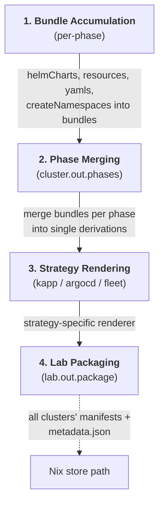

# Manifest Rendering Pipeline

The manifest pipeline transforms high-level component declarations into deployment-ready Kubernetes YAML. It runs entirely at Nix build time, producing deterministic output in the Nix store.

## Pipeline Stages



## Stage 1: Bundle Accumulation

Components write their Kubernetes resources into **bundles** within their assigned **phase**. A bundle is the finest-grained deployment unit and can contain three types of content:

```nix
phases.${cfg.phase}.bundles.cert-manager = {
  # Namespaces to create (collected across all phases, created in the namespaces phase)
  createNamespaces = [ cfg.namespace ];

  # Helm charts to render via helm template
  helmCharts.cert-manager = {
    chart = cfg.chart;
    namespace = cfg.namespace;
    releaseName = "cert-manager";
    values = {
      crds.enabled = true;
      replicaCount = 1;
    };
    extraOpts = [ "--include-crds" ];
    kustomize = {
      enable = false;
      patches = [];
      resources = [];
    };
  };

  # Typed Kubernetes resources (checked by the NixOS module type system)
  resources.lab-ca-issuer = {
    apiVersion = "cert-manager.io/v1";
    kind = "ClusterIssuer";
    metadata.name = "lab-ca";
    spec.ca.secretName = "lab-ca-ca-secret";
  };

  # Raw YAML (strings, paths, or derivations)
  yamls = [ ];
};
```

### Helm Charts

Helm charts are rendered using `helm template` inside a Nix derivation (`lib/render.nix:renderHelmChart`). The rendering process:

1. Writes `values.yaml` from the Nix attrset
2. Runs `helm template` with the specified release name, namespace, and extra options
3. Post-processes the output to inject `metadata.namespace` into namespaced resources (since `helm template` does not apply namespace like `helm install` does)
4. Optionally applies kustomize patches if `kustomize.enable = true`

### Typed Resources

Resources defined in `resources` are Nix attribute sets that conform to Kubernetes API types generated from OpenAPI specs and CRDs. The type system catches structural errors at `nix eval` time.

### Raw YAML

The `yamls` list accepts strings (inline YAML), paths, or derivations. CRD YAML files are automatically split by API group for manageability.

## Stage 2: Phase Merging

The `cluster.out.phases` option (`modules/lab/cluster/out.nix`) merges all bundles within each phase:

1. **Collect all namespaces** from all bundles across all phases
2. **Merge bundle contents** per phase: fold all `helmCharts`, `resources`, and `yamls` from all bundles in that phase
3. **Inject namespace YAMLs** into the `namespaces` phase
4. **Render derivations** via `render.renderPhase`, which produces a store path containing all YAML files for that phase
5. **Filter empty phases** -- phases with no content are dropped

The result is an attrset where each key is a phase name and each value contains:

```nix
{
  order = 10;           # Numeric ordering
  dependsOn = [ ... ];  # Phase dependencies
  keepResources = false;
  pruneStrategy = "default";
  waitForReady = true;
  timeout = "10m";
  waitForCRDs = false;
  crdNames = [];
  package = <derivation>;  # Rendered YAML files
}
```

## Stage 3: Strategy Rendering

The `lab.out.manifests` option (`modules/lab/out.nix`) passes each cluster's merged phases through a strategy-specific renderer from `lib/renderers/`. The lab's `cd.strategy` setting selects the renderer.

### kapp Renderer

Produces a flat directory structure with numbered phase directories:

```
kapp-core/
  core/
    00-crds/
      cilium-crds.yaml
    01-namespaces/
      namespaces-resources.yaml
    02-networking/
      cilium.yaml
      traefik.yaml
    03-operators/
      cert-manager.yaml
    ...
    .phase-order          # Ordered list of phase names
    .deploy-strategy      # "kapp"
    .deploy-config        # waitTimeout: 10m
```

The kapp renderer also applies resource name prefixing (when `lab.prefix` is set) and generates `.crd-wait` files for phases that require CRDs to be established before deployment.

### ArgoCD Renderer

Produces Application and ApplicationSet resources that point to a git repository. The rendered manifests are organized for ArgoCD to discover and sync.

### Fleet Renderer

Produces Bundle resources for Rancher Fleet, with similar directory organization but Fleet-specific metadata.

## Stage 4: Lab Packaging

The `lab.out.package` option combines all clusters' rendered manifests into a single Nix derivation:

```
lab-homelab.local/
  metadata.json           # Pretty-printed lab metadata
  manifests/
    core -> /nix/store/...-kapp-core/core
    obs  -> /nix/store/...-kapp-obs/obs
    mgmt -> /nix/store/...-kapp-mgmt/mgmt
  bin/
    homelab.local-ops     # Lab ops tool (if defined)
```

The `metadata.json` file contains:

- Lab name and prefix
- List of cluster names
- CD strategy and config
- Per-cluster topology (provider, nodes, network, enabled components)
- Per-cluster software bill of materials (component versions)
- Per-cluster namespace lists (used by lint checks)

## How the CLI Consumes the Pipeline Output

When the user runs `cata lab up`, the CLI:

1. Calls `nix eval` to get the lab's CLI config (cluster names, services, DNS, etc.)
2. Provisions infrastructure services (DNS, registry, ingress) as Docker containers
3. Provisions each cluster via k3d
4. Calls `nix build` on the lab package, triggering the full rendering pipeline
5. For each cluster, discovers phases from the `.phase-order` file
6. Deploys phases sequentially via kapp, waiting for CRDs and injecting SOPS secrets at phase boundaries

The `cata lab publish` command follows the same build step but instead pushes the rendered manifests to a git repository for GitOps consumption.

## Built-in Phase Ordering

Phases are deployed in numeric order. The built-in phases and their default ordering:

| Order | Phase | Purpose |
|-------|-------|---------|
| -10 | `crds` | Custom Resource Definitions |
| -5 | `namespaces` | Namespace creation (auto-collected from all bundles) |
| 0 | `networking` | CNI, gateway, service mesh |
| 10 | `operators` | Operator deployments (cert-manager, CNPG, etc.) |
| 20 | `secrets` | Secret injection and external secret sync |
| 30 | `infrastructure` | Infrastructure services (DNS, storage, registries) |
| 40 | `gitops` | GitOps controllers (ArgoCD) |
| 50 | `databases` | Database instances |
| 90 | `apps` | Application workloads |
| 100 | `workloads` | User workloads |

Components select their phase via the `phase` option. Phases that end up empty (no bundles with content) are automatically excluded from the rendered output.
