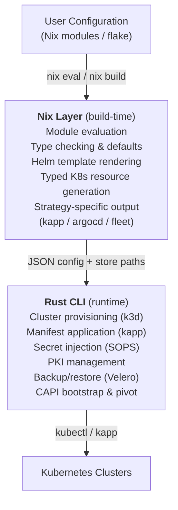

# Architecture Overview

Catallaxy is a declarative Kubernetes platform built on two foundations: the NixOS module system for configuration and manifest rendering, and a Rust CLI for runtime orchestration. This separation keeps the build-time logic pure and reproducible while giving operators a single command-line tool for day-to-day cluster management.

## Two-Layer System

**Nix layer** -- Everything that can be computed at build time lives here. The NixOS module system evaluates lab and cluster configurations, resolves cross-references between components and clusters, renders Helm charts via `helm template`, generates typed Kubernetes resources, and packages everything into Nix store derivations. The output is deterministic: the same configuration always produces the same manifests.

**Rust CLI** -- The `cata` binary handles operations that require interacting with the outside world: provisioning clusters, applying manifests, managing secrets, issuing PKI certificates, and orchestrating CAPI bootstrap sequences. It calls `nix eval` and `nix build` to obtain configuration data and rendered manifests, then uses external tools (kubectl, kapp, k3d, sops, velero) to act on them.

## Multipass Compiler Analogy

The system can be understood as a multi-pass compiler where Kubernetes manifests are the compiled output:

| Pass | What it does | Where it lives |
|------|-------------|----------------|
| **Declaration** | High-level NixOS options define the user interface. Components declare options like `enable`, `namespace`, `phase`, and domain-specific settings. | `modules/lab/cluster/components/` |
| **Intermediate Representations** | The module system computes intermediate representations: phase bundles (Helm charts + typed resources + raw YAML), provisioning config, cluster topology, and software bill of materials. | `modules/lab/cluster/out.nix`, `modules/lab/out.nix` |
| **Target Rendering** | Strategy-specific renderers transform the IR into deployment-ready output for kapp, ArgoCD, or Fleet. Each renderer produces a different directory layout. | `lib/renderers/kapp.nix`, `lib/renderers/argocd.nix`, `lib/renderers/fleet.nix` |

This multi-pass design means the same component declarations can target different CD systems without changing any component code.

## Separation of Eval, Build, and Runtime

The three phases have distinct responsibilities and never cross boundaries:

### Eval Phase (`nix eval`)

The CLI calls `nix eval --json` to obtain cluster and lab configuration as JSON. This evaluates the module system but does not build any derivations. The result contains:

- Cluster metadata (name, provider, network config)
- Component settings (enabled state, versions, namespaces)
- Provisioner configuration (k3d cluster names, images, ports)
- Lab topology (cluster names, services, DNS info)

### Build Phase (`nix build`)

When manifests are needed, the CLI calls `nix build` on the lab package or cluster manifests output. This triggers Helm chart rendering, resource serialization, and strategy-specific packaging -- all inside the Nix sandbox. The output is a Nix store path containing:

- Numbered phase directories (`00-crds/`, `01-namespaces/`, etc.)
- Rendered YAML manifests within each phase
- A `.phase-order` file encoding deployment sequence
- A `.deploy-config` file with strategy-specific settings
- A `metadata.json` file with topology and SBOM data

### Runtime Phase (`cata` CLI)

The CLI reads the built store paths and orchestrates deployment:

1. Provision clusters via k3d (or CAPI bootstrap for production)
2. Discover phases from the rendered manifest directory
3. Deploy phases sequentially via kapp, injecting SOPS secrets at the appropriate phase boundaries
4. Wait for CRDs to be established before deploying phases that depend on them

This separation means Nix never needs network access during builds (no import-from-derivation), and the CLI never needs to understand Helm charts or Nix module evaluation.

